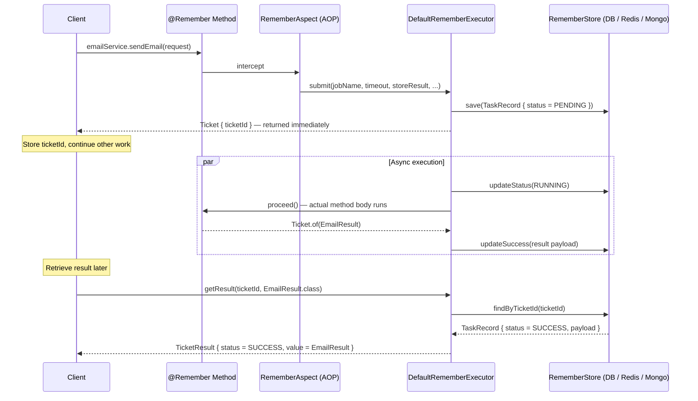

# FireAndRemember (fnr)

A Java library for tracking and managing async tasks.
Turns fire-and-forget into fire-and-remember — a `ticketId` is all you need to reliably retrieve async task results, regardless of what happens in between.

**Requirements:** Java 21+ · Spring Boot 3.x+

---

## Dependencies

**With Redis**
```gradle
implementation 'io.github.fire-and-remember:fnr-spring:0.2.0'
implementation 'io.github.fire-and-remember:fnr-store-redis:0.2.0'
```

**With JDBC**
```gradle
implementation 'io.github.fire-and-remember:fnr-spring:0.2.0'
implementation 'io.github.fire-and-remember:fnr-store-jdbc:0.2.0'
```

**With MongoDB**
```gradle
implementation 'io.github.fire-and-remember:fnr-spring:0.2.0'
implementation 'io.github.fire-and-remember:fnr-store-mongo:0.2.0'
```

> `fnr-spring` includes `fnr-core`, so you only need two dependencies.

---

## API Flow



---

## Basic Usage

```java
// 1. Annotate the method — return Ticket.of(result) to persist the result
@Remember(jobName = "send-email", timeout = 30, timeoutUnit = TimeUnit.SECONDS,
          storeResult = true, storeParameters = false)
@Transactional
public Ticket<EmailResult> sendEmail(EmailRequest request) {
    EmailResult result = mailClient.send(request);
    return Ticket.of(result);
}

// 2. Call it — receive only a Ticket
Ticket<EmailResult> ticket = emailService.sendEmail(request);
String ticketId = ticket.getTicketId();

// 3. Retrieve the result later (non-blocking)
TicketResult<EmailResult> result = fnrTicketService.getResult(ticketId, EmailResult.class);

// 3-1. Or block until completed (up to 30 seconds)
TicketResult<EmailResult> result = fnrTicketService.waitForResult(ticketId, EmailResult.class, 30);
```

> The method must return `Ticket<?>`, otherwise an `IllegalStateException` is thrown at startup.

---

## Configuration

Choose a config based on your Java version:

### Virtual Threads (default)

Uses one virtual thread per task. Recommended for most use cases.

```java
@Bean
public FnrConfig fnrConfig() {
    return VirtualThreadFnrConfig.builder().build();
}
```

### Thread Pool (back-pressure control)

Use when you need to cap concurrent task execution — e.g., to protect a downstream DB or external API from being overwhelmed.

```java
@Bean
public FnrConfig fnrConfig() {
    return ThreadPoolFnrConfig.builder()
        .threadPoolSize(20)      // max concurrent tasks (default: 10)
        .build();
}
```

> If no `FnrConfig` bean is registered, `VirtualThreadFnrConfig` is used by default.

### yaml (applies when no `FnrConfig` bean is registered)

```yaml
fnr:
  use-virtual-threads: true   # set to false to use a fixed thread pool (default: true)
  thread-pool-size: 10        # only used when use-virtual-threads is false (default: 10)
```

---

## Behavior Notes

**`storeResult`** is configured per-method on the `@Remember` annotation (default: `true`).
When `false`, `getResult().getValue()` is `null` but status is still tracked.

**`storeParameters`** is configured per-method on the `@Remember` annotation (default: `false`).
When `true`, method arguments are JSON-serialized and retrievable via `getResult().getParamPayload()`.

---

## Serialization

Parameters and results are serialized with Jackson (`jackson-databind`).
Jackson must be on the classpath when `storeResult` or `storeParameters` is `true`.

> Result type `T` must be deserializable by Jackson (i.e., have a no-arg constructor or `@JsonCreator`).

---

## JDBC Schema

When using `fnr-store-jdbc`, create the table manually before starting the application.
Default schema:

```sql
CREATE TABLE IF NOT EXISTS fnr_tasks (
    ticket_id        VARCHAR(36)  NOT NULL PRIMARY KEY,
    job_name         VARCHAR(255) NOT NULL,
    status           VARCHAR(20)  NOT NULL,
    started_at       TIMESTAMP    NOT NULL,
    completed_at     TIMESTAMP,
    timeout_seconds  BIGINT       NOT NULL,
    result_payload   TEXT,
    param_payload    TEXT,
    error_message    TEXT
);

-- recommended: improves query performance when filtering by status or job_name
CREATE INDEX IF NOT EXISTS idx_fnr_tasks_status   ON fnr_tasks(status);
CREATE INDEX IF NOT EXISTS idx_fnr_tasks_job_name ON fnr_tasks(job_name);
```

To use a custom table or column names:

```java
@Bean
public JdbcStoreConfig jdbcStoreConfig() {
    return JdbcStoreConfig.builder()
        .tableName("my_tasks")
        .colStatus("task_status")
        .build();
}
```

> When using a custom `JdbcStoreConfig`, the table and column names are validated against the actual DB schema at startup.

---

## TTL

**Redis** supports TTL natively. Records are automatically expired after the configured duration.

```yaml
fnr.store.redis.ttl: 1h
```

TTL is optional. When not set, records persist indefinitely.

**JDBC** does not support TTL. Records persist until manually deleted. Implement your own cleanup job if needed.

**MongoDB** does not have a built-in TTL option in this library. Use a MongoDB TTL index on the `completedAt` field if needed:
```javascript
db.fnr_tasks.createIndex({ "completedAt": 1 }, { expireAfterSeconds: 3600 })
```

---

## In-Memory Store (local/testing only)

`fnr-core` ships with `InMemoryRememberStore` for local development and testing without a database.

```java
@Bean
public RememberStore rememberStore() {
    return new InMemoryRememberStore();
}
```

> **Not for production.** Data is stored in-heap and lost on every restart — which defeats the core purpose of this library.
> A `WARNING` log is printed at startup as a reminder.

---

## Module Structure

```
fire-and-remember/
├── fnr-core            # Pure Java 21, no external dependencies (Jackson compileOnly)
├── fnr-store-jdbc      # Spring JDBC implementation
├── fnr-store-redis     # Redisson implementation (TTL support)
├── fnr-store-mongo     # Spring Data MongoDB implementation
└── fnr-spring          # Spring Boot AutoConfiguration (includes fnr-core)
```
